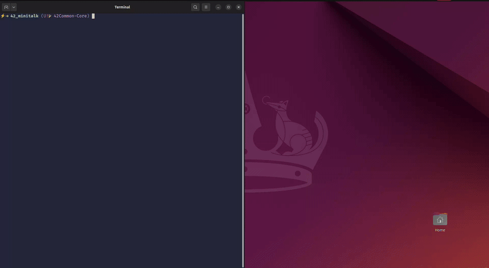

  <h1>MiniTalk</h1>
  
Signal-driven client/server messaging with deterministic acknowledgments.

| [About](#about) | [Custom Tester](#custom-tester) | [Subject Compliance](#subject-compliance) | [Repository Layout](#repository-layout) | [Build &amp; Integration](#build-and-integration) | [Usage Guidelines](#usage-guidelines) | [Conversion/Feature Tables](#conversion-feature-tables) | [Flags &amp; Feature Handling](#flags) | [Internal Architecture](#internal-architecture) | [Tester Workflow](#tester-workflow) | [Results &amp; Reporting](#results-and-reporting) | [Related Projects](#related-projects) |

  <table>
    <tr>
      <td width="100%">
        
      </td>
    </tr>
  </table>
  
<em>Running tester &amp; showcasing results at a glance</em>

## About
- `server.c` boots with `sigaction` configured for `SA_SIGINFO | SA_RESTART | SA_NODEFER`, mapping `SIGUSR1` and `SIGUSR2` onto a bit accumulator so `action` rebuilds characters inside a static `bit_buffer`.
- `process_character` lazily allocates a `BUFFER_SIZE` (100000) heap buffer, appends bytes until a null terminator arrives, prints through `ft_printf`, and frees/reset state before acknowledging the sender.
- `client.c` validates the supplied PID via `kill(pid, 0)`, then streams each byte MSB-first through `send_signal`, blocking on `pause()` until `wait_validation` toggles the `volatile` `g_ack_received` flag.
- The bonus implementation keeps the same handshake while widening types to `unsigned char`, so multi-byte UTF-8 payloads transit the signal channel without truncation.

## Custom Tester
- `make tester` compiles both endpoints, cleans any stale `results/` folder, and stages a fresh workspace for deterministic runs.
- `start_server` launches `./server` wrapped in `stdbuf -oL`, wiring its stdout into `results/server.out` while persisting the background PID in `results/server.pid` for later teardown.
- Test vectors live in `tester/test_cases.txt` and the optional `tester/test_cases_bonus.txt`; the Makefile prompts before concatenating the emoji-heavy bonus data into `results/test_cases_combined.txt`.
- An `awk '{print NR, length($0), $0}'` pipeline enumerates each message, echoing metadata to the terminal and piping the payloads into `./client`, which allows us to observe round-trip timing against varied lengths.

## Subject Compliance
- The server prints its PID on launch through `ft_printf`, then blocks on `pause()` with signals as the sole transport, fulfilling the mandatory requirements.
- `SIGUSR1` encodes zero bits and `SIGUSR2` encodes ones; the server acknowledges every bit via `kill(info->si_pid, SIGUSR1)` and issues a final `SIGUSR2` after null termination, matching the bonus acknowledgment rules.
- Heap usage stays bounded: the client works entirely on the stack, and the server owns exactly one `malloc`d buffer per message that is freed immediately after printing.
- Bonus sources reside in `_bonus.c` files under `srcb/`, and `make bonus` swaps them in without touching the mandatory pipeline, keeping the evaluation paths isolated per subject guidelines.

## Repository Layout
- `src/` contains the mandatory `client.c` and `server.c`, each exposing only static helpers so they remain Norm-compliant without extra headers.
- `srcb/` mirrors the mandatory structure with `client_bonus.c` and `server_bonus.c`, replacing signed chars with `unsigned char` to guarantee emoji safety.
- `tester/` holds `test_cases.txt` for baseline coverage and `test_cases_bonus.txt` packed with extended UTF-8 data to exercise the bonus build.
- `docs/` ships the official `subject_minitalk.pdf` plus `video/running_tester.webm` (source capture) and `video/running_tester.gif` (embedded animation), giving reviewers instant tester context.
- `Makefile` writes objects to `obj/` and runtime evidence to `results/`, keeping the root clean between runs.

## Build &amp; Integration
- `make` (or `make all`) lazily clones the `libft` repository if needed, builds it silently, and links both executables against `libft.a` with the mandated `-Wall -Wextra -Werror` flags.
- `make bonus` reuses the same object rule, targets `_bonus` sources, and relinks the binaries so you can toggle UTF-8 support without manual file juggling.
- `make clean` removes `obj/`, binaries, and `results/`, while `make fclean` additionally nukes the vendored `libft` before `make re` restores the toolchain, matching the subject's relinking expectations.
- `VFLAGS` offers a ready-made Valgrind configuration (`--leak-check=full --show-leak-kinds=all --track-origins=yes`), so deep diagnostics are a one-liner away when investigating signal timing.

## Usage Guidelines
- Build the project (`make` or `make bonus`), then launch `./server`; it prints `Server PID: <pid>` and waits indefinitely for clients.
- From another terminal, call `./client <server_pid> "message"`; each character is shifted out MSB-first, and the client blocks on `pause()` until the server acknowledges each bit through `wait_validation`.
- Completion is explicit: the client remains alive until the server emits a `SIGUSR2`, which `terminate_client` traps to exit only after the message is flushed.
- `BUFFER_SIZE` guards the per-message allocation; if a payload would overflow, `process_character` simply stops appending beyond `BUFFER_SIZE - 1`, avoiding undefined writes while still acknowledging progress.

## Conversion/Feature Tables
- The table below contrasts mandatory and bonus traits, linking each behavior to the underlying helpers so reviewers can map features back to source instantly.

| Capability | Mandatory Build | Bonus Build |
| --- | --- | --- |
| Character encoding | Signed `char` flow handled by `process_character` in `server.c` | `unsigned char` pipeline in `server_bonus.c` keeps multi-byte UTF-8 data intact |
| Delivery guarantee | Bit-level ACK via `kill(info->si_pid, SIGUSR1)` inside `action` | Same ACK plus final `SIGUSR2` captured by `terminate_client` to close the session |
| Throughput handling | `pause()` loop with `SA_RESTART` avoids busy waits while processing bits | Identical guard ensures Unicode bursts do not trigger signal loss |
| Buffer management | Lazy `malloc` reset per message ensures quick reuse of `BUFFER_SIZE` | Same pattern, coupled with explicit error messaging on allocation failure |

- Because both builds share the `send_signal` routine, message ordering stays identical; the bonus path simply propagates every byte emitted by UTF-8 encoders.

## Flags &amp; Feature Handling
- Both builds register handlers with `SA_SIGINFO`, giving direct access to `info->si_pid` so the server can reply to any client without global state tracking.
- `SA_NODEFER` keeps handlers reentrant, allowing consecutive signals to arrive without being blocked; the `processing` guard in `action` documents that the decoder expects serialized delivery.
- Handler functions set `SA_RESTART`, ensuring syscalls like `pause()` resume automatically after signal handling, which keeps both processes responsive without manual loops.
- The shared `g_ack_received` flag is marked `volatile` so the compiler respects updates performed inside signal handlers, preserving synchronization across the asynchronous boundary.

## Internal Architecture
- `main` in `client.c` validates input count, converts the PID through `ft_atoi`, sanity-checks it using `kill(pid, 0)`, and then registers `wait_validation` and `terminate_client` before dispatching to `send_message`.
- `send_message` iterates over every byte, calling `send_signal` which shifts each bit out from position 7 down to 0, invoking `kill(server_pid, SIGUSR1|SIGUSR2)` and pausing until the server replies.
- `action` in `server.c` left-shifts `bit_buffer`, ORs in `1` when receiving `SIGUSR2`, increments `bit_index`, and once eight bits land, forwards the byte to `process_character` before resetting its local state.
- When `process_character` receives `\0`, it prints the accumulated string, frees the heap buffer, resets indices, and signals completion via `SIGUSR2`, making the server ready for the next client instantly.

## Tester Workflow
- Invoking `make tester` first ensures the previous server instance is stopped, then relaunches a fresh one and waits until `results/server.out` contains the PID banner.
- The Makefile copies `tester/test_cases.txt` into `results/test_cases_combined.txt`, optionally appending the bonus suite when you answer `y` at the prompt.
- The AWK loop emits `Test ID` and `Length` metadata before calling `./client`, letting you see latency against message sizes in real time while the server logs the reconstructed text.
- After all cases run, `tail -n +2 results/server.out | diff -u results/test_cases_combined.txt -` compares expected versus received payloads, teeing discrepancies into `results/diff.log` for post-run inspection.

## Results &amp; Reporting
- Success path prints `All Tests PASSED congratulations!` from the tester, confirming the diff produced no mismatches and that the signal handshake matched the ground truth data.
- Any divergence triggers a red `FAILED` banner and leaves a unified diff in `results/diff.log`, pinpointing the first mismatched line so you can replay the scenario quickly.
- Real-time server output streams through the spawned `tail -f results/server.out` terminal, making it easy to correlate client logs with server echoes during debugging sessions.
- Cleaning via `make clean` removes both the log and PID files, so each tester execution starts from a blank reporting slate.

## Related Projects
- This repository relies on the in-house [`libft`](./libft) and [`ft_printf`](./libft/printf) codebases, ensuring formatting stays consistent across 42 deliverables.
